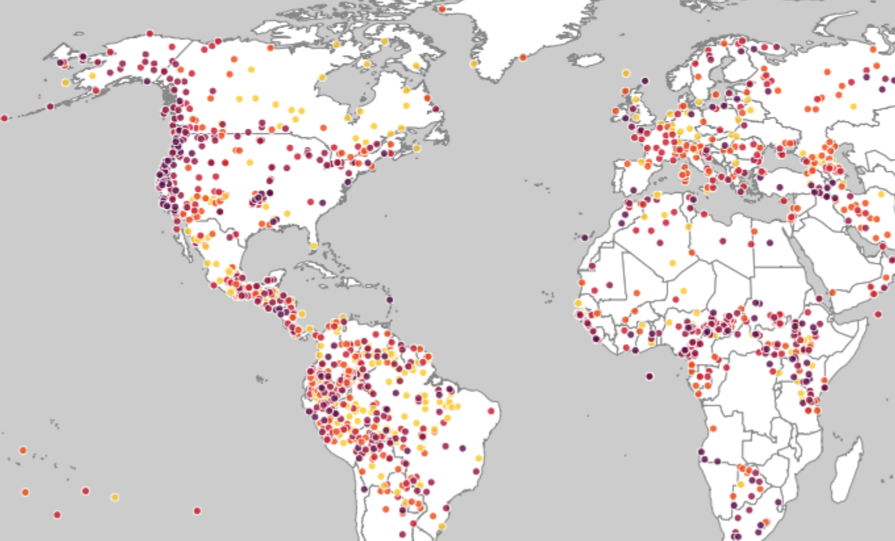
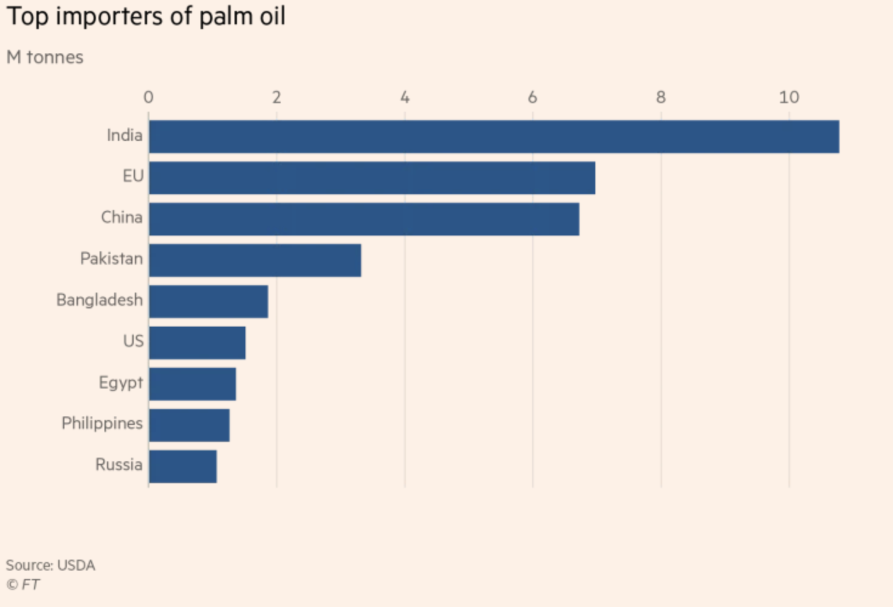

# Appendix: P1: Report outline
## **Rainforest-killing Ramen**
Project: cup noodle
Annabel Lee, Lee Shi, Ming Yan
```
Info-201: Technical Foundations of Informatics
The Information School
University of Washington
Autumn 2019
```
### 1.0 Introduction
* ##### 1.1 PROBLEM SITUATION
Many people eat ramen, either because they like the taste and it is easy to cook, or because of its high value obtained in that relative low affordable price. It is also the top purchased foods for low income families while providing enough nutritional value in diets. However, this food contributes the affect of climate change due to its large amount of palm oil— an ingredient that is causing much deforestation to our planet. Palm oil production is harmful to our rainforests and endangering many wildlife habitats and animals.
* ##### 1.2 What is the problem?
Though, ramen is a great, filling cheap meal— they also have a major impact on our rainforests. Our team wants to find out what is the best tasting ramen alternative (cup/pack) made in the US that is organic and much more environmentally friendly to encourage avid ramen eaters that they should not sacrifice their favorite snack but instead switch to make a more conscious choice to help the earth.  We are only focusing on native ramen products, which should be beneficial for both people who like ramen and people who need saving money to know, because the ramen should be delicious as well as price friendly and accessible.
* ##### 1.3 What does it matter?
When people become more knowledgable about what they are purchasing, it enables them to make the right choice to help save our rainforests and endangering species. For people who like ramen, they will find it helpful when they pick the next ramen on the go. As for people who are running short for money, it is good that a US made ramen is usually cheaper than imported ones. In short, since ramen is a part of life for many people, it is better for them to know more about how they could be more aware of their grocery purchases.
* ##### 1.4 How it will be addressed?
Our team will look at the data for all native brands, products, and their ratings. Compare the flavor and the taste to come up with a conclusion that which is the best rated ramen overall, which is the best one under specific settings like spicy ramen. Hopefully we can find a better alternative instant ramen or create a visual branding for ramen labels to educate the public on their purchases.

### 2.0 Research Questions

- Which ramen are the top 10 based on the dataset?
- Are there any American products?
- Which are the top 10 under all American Products?
- How can those 10 be classified?
- How does the production of ramen affect climate change?
- How much waste does ramen produce? Are there any environmentally friendly instant ramen people can switch to?

### 3.0 Possible data sets
- Ramen ratings of types of different types of ramen
- Palm oil production

### 4.0 Information Visualizations


_Figure 1. This graphic uses color coding to show locations of endangered species around the globe. In our project, we propose to create a similar information visualization and allow users to explore country level details.
(Source: Medium) [4]_


_Figure 2. This bar chart displays top importers of palm oil by country. In our project, we would like to implement something similar but by brand of ramen.
(Source: USDA) [5]_

### 5.0 Team Coordination
- We can do meet ups every Friday afternoon
- Our goals 
  - Ming: personally a ramen lover, always heard that Asian ramen are the best ramen, 
    but I  want to find out the best American ones.
  - Annabel: to be able to clearly communicate how to visualize a large complex amount
    Of data.
  - Lee: to learn how to collect data and use them to create strong arguments.
- We will communicate through message and Facebook; we will work through this project together and
divide the work evenly. Ming will be responsible for ideas and plannings, Lee will be responsible for doing
research, and Annabel will be responsible for consolidating it all. All of us will do the coding part together.

### 6.0 Questions for Teaching Team
Are there any other datasets we should add to our current collection to improve our arguments? And any advice for our project?

### 7.0 References
[1]“Palm Oil.” WWF, World Wildlife Fund, www.worldwildlife.org/industries/palm-oil.

[2] Aleksey, B. (2017). Ramen Ratings over 2500 ramen ratings. Retrieved from https://www.kaggle.com/residentmario/ramen-ratings

[3] Gaworecki, Mike. “If You're in the U.S., Your Ramen Noodles Might Become a Lot Safer for Forests.” Mongabay Environmental News, 22 Nov. 2016, https://news.mongabay.com/2016/11/if-youre-in-the-u-s-your-ramen-noodles-might-become-a-lot-safer-for-forests/.

[4] Cheng, Ming. “World Map Data Visualization of Extinct and Endangered Language.” Data Visualization for Extinct and Endangered Language, Medium, 9 Mar. 2017, towardsdatascience.com/data-visualization-for-extinct-and-language-9cd75fe41da.

[5] Terazono, Emiko. “Top Importers of Palm Oil.” EU’s Palm Oil Energy Use Soars despite Deforestation Threat, Financial Times, 2 July 2019, www.ft.com/content/b0cfefbe-99b0-11e9-8cfb-30c211dcd229.
